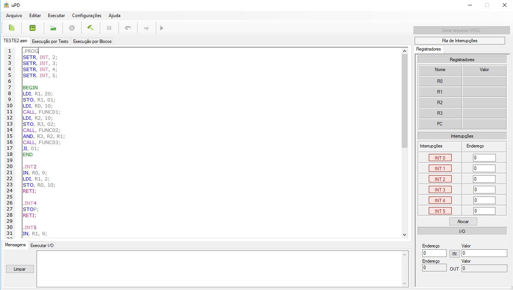

<!-- TABLE OF CONTENTS -->
# Tabela de Conteúdo

* [Sobre o Projeto](#sobre-o-projeto)
  * [Intuito](#intuito)
  * [Equipe](#time)
* [Sobre o Processador](#sobre-o-processador)
  * [Formato de Instrução](#formato-de-instrução)
  * [Como foi Desenvolvido](#como-foi-desenvolvido)
* [Sobre o Software](#sobre-o-software)
* [Como Usar](#como-usar)
* [Como Contribuir](#como-contribuir)
* [Roadmap de Melhorias](#roadmap-de-melhorias)
   
***  

<!-- ABOUT THE PROJECT -->
## Sobre o Projeto
O μPD surgiu como uma ferramenta para ajudar no ensino de Arquitetura de Computadores, sendo um processador monociclo cujo pode ter todas as suas instruções simuladas visualmente através de um software de simulação. O projeto foi expandido para uma IDE onde era possível gerar um programa no assemvbly do μPD, compilar e executar, além de gerar o binário do programa desenvolvido. Também foi acrescentado uma ferramenta de geração do "esqueleto" do seu código VHDL (o qual ele foi desenvolvido) para uso em um kit educacional de FPGA.
### Intuito
O objetivo sempre foi contribuir com o aprendizado dos alunos, englobando em um mesmo processador a possibilidade de aprendizado de várias áreas da computação em conjunto.
### Equipe
Quem projetou a arquitetura do processador, bem como boa parte do código em VHDL foi o [Marcelo Daniel Berejuck](https://linkedin.com/in/marcelo-daniel-berejuck-0b923064). A [Morgana Sartor](https://linkedin.com/in/morgana-sartor) foi quem ajudou no desenvolvimento do código VHDL e testes, e foi uma das programadoras do software de simulação. A [Thaynara Mitie](https://linkedin.com/in/thaynara-mitie) foi uma das programadoras do software e responsável por seus testes de funcionamento.

***

<!-- ABOUT THE PROCESSOR -->
## Sobre o Processador
O μPD utiliza uma arquitetura baseada na arquitetura RISC (Reduced Instruction-Set Computer), o que significa que todas as operações são realizadas com o uso dos registradores. A arquitetura RISC é muitas vezes chamada de “arquitetura Load/Store”. O processador μPD possui um Banco de Registradores com quatro registradores de uso geral (R0, R1, R2 e R3) que podem ser utilizados pelo usuário sem nenhuma restrição.

O procesador μPD é dividido em dois caminhos lógicos, denominados de Caminho de Controle e Caminho de Dados. O caminho de controle é responsável por ler as instruções de
máquina armazenadas em uma memória do tipo ROM (Read Only Memory), externa ao processador, e controlar o fluxo de execução das tarefas no caminho de dados. Seus principais componentes internos são a unidade de CONTROLE e uma memória tipo LIFO (Last in, First Out), usada para salvar os registradores quando é executada uma chamada de subrotina (instrução CALL e RET).

O caminho de dados é composto de um Banco de registradores (com quatro registradores), uma Unidade Lógica e Aritmética (ULA), uma memória tipo RAM (Random Access Memory), além
de registradores que fazem interface com pinos de I/O (pinos da porta de entrada e saída de dados do processador). É possível conectar na porta I/O diversos dispositivos, que são comandados pelos sinais de endereços da porta I/O. Assim, é possível conectar até 512 dispositivos diferentes nesta
porta. 

A memória RAM interna tem capacidade para armazenar até 0,5 KWords ou 1KByte. Esse também é o tamanho máximo que um programa poder ter e ser armazenado na memória ROM.
O processador μPD permite o uso de até seis (06) interrupções externas, programáveis. A interrupção de maior prioridade é a INT(0) e a de menor, INT(5). A cada interrupção gerada, o processador faz uma CALL para um endereço específico na memória ROM

### Formato de Instrução
As instruções do processador possuem dois seis tipos de formatos, conforme mostra a Figura abaixo. Operações que envolvem três registradores utilizam o formato mostrado na Figura (a), operações que envolvem apenas um registrador destino e outro de entrada estão representadas na Figura (b), operações apenas com os dois registradores de entrada estão na Figura (c), e as operações apenas com registrador de destino estão representadas na Figura (d). Também existem operações que não envolvem registradores, elas estão representadas nas figuras (e) e (f). Abaixo estão descritas as instruções.
| Mnemônico | Opcode (binário) | Opcode (hexadecimal) | Descrição |
|-----------|------------------|----------------------|-----------|
| NOP       | 00000            | 00                   | “No operation”. Processador gasta um ciclo de relógio se fazernenhuma operação.|
| LDI       | 00001            | 01                   | Carrega valor imediato contido na instrução (bits de 0 a 8) em umdeterminado Registrador (RDST).|
| ADD       | 00010            | 02                   | Soma o conteúdo de dois registradores e armazena o resultado emum terceiro registrador.|
| SUB       | 00011            | 03                   | Subtrai o conteúdo de dois registradores e armazena o resultado emum terceiro registrador.|
| OUT       | 00100            | 04                   | Escreve o valor contido em um registrador (R0, R1, R2 ou R3) nos pinos de I/O.|
| IN        | 00101            | 05                   | Lê o valor contido na porta de I/O em um dos registradores (R0, R1, R2 ou R3).|
| JI        | 00110            | 06                   | Salto (jump) incondicional. Salta para o endereço contido na instrução (bits de 0 a 8).|
| LD        | 00111            | 07                   | Carrega conteúdo armazenado na memória RAM (endereço nos bits 0 a 8) em um dos registradores (R0, R1, R2 ou R3).|
| STO       | 01000            | 08                   | Armazena conteúdo de um registrador (R0, R1, R2 ou R3) em uma posição de memória RAM (endereço nos bits 0 a 8).|
| JZ        | 01001            | 09                   | Salto condicional (jump) se o conteúdo de um registrador (R0, R1, R2 ou R3) for igual a 0 (zero).|
| JE        | 01010            | 0A                   | Salto condicional (jump) se o conteúdo de um registrador (R0, R1, R2 ou R3) for igual a 1 (um). Usar CMP antes.|
| AND       | 01011            | 0B                   | Executa E lógico entre o conteúdo de dois registradores, armazenando o resultado em um terceiro registrador.|
| OR        | 01100            | 0C                   | Executa OU lógico entre o conteúdo de dois registradores, armazenando o resultado em um terceiro registrador.|
| XOR       | 01101            | 0D                   | Executa OU EXCLUSIVO lógico entre o conteúdo de dois registradores, armazenando o resultado em um terceiro registrador.|
| NOT       | 01110            | 0E                   | Executa NÃO lógico no conteúdo de um registrador, armazenando o resultado em um segundo registrador.|
| CALL      | 01111            | 0F                   | Chamada de subrotina (função). Endereço de salto está na instrução (bits de 0 a 8).|
| RETI      | 10000            | 10                   | Retorno de interrupção. Volta par o ponto onde estava sendoexecutado o programa antes da ocorrência da interrupção.|
| SETR      | 10001            | 11                   | Configura registradores internos do processador. No momento existeapenas o INT, que habilita interrupções externas.|
| STOP      | 10010            | 12                   | Para a execução do programa por tempo indeterminado.|
| RET       | 10011            | 13                   | Retorno de subrotina (função). Retorna para o endereço de onde foi chamada a última subrotina (CALL).|
| CMP       | 10100            | 14                   | Compara o conteúdo armazenado em dois registradores quaisquer (R0, R1, R2 ou R3).|

### Como foi Desenvolvido
Cada componente interno do processador foi representado como uma classe no software. Tiveram seu funcionamento interno exporto de forma visual os seguintes componentes:
 * Banco de Registradores
 * Memória RAM
 * In/Out

***

<!-- ABOUT SOFTWARE -->
## Sobre o Software

***

<!-- HOW TO USE -->
## Como Usar

***

<!-- HOW TO CONTRIBUTE -->
## Como Contribuir

***

<!-- ROADMAP -->
## Roadmap de Melhorias
